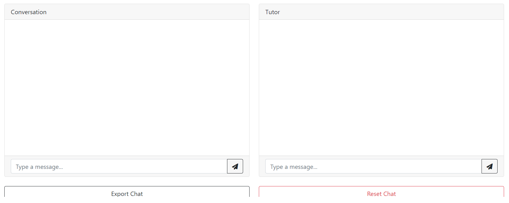

# Role-Play Chat for Language Learning

## Welcome!

This is a detailed description on how to use the role play chat for language learning. Let's get started!

To begin with, please fill out the configuration inputs required.

The **Notes for AI** and **API Key** fields are optional.

You can fill the **Notes for AI** like "Today is your birthday", then when you start the chat, the AI knows that today is its birthday.

**API Key** is required only if you don't have your local API set up. If you just want to test this out, you will need to insert your API key in here every time you restart the chat. To set-up your local API key, open the **server.py** file and locate this line of code: (at the beginning)

- Have your **OPENAI_API_KEY.txt** contain your API key and place it in the same folder with your server.py file.

Let's continue! This is just a sample.

- Please use proper and rational scenario settings e.g. customer & waiter in a restaurant. Otherwise, the AI may behave strangely.

Once that's done. You can find these two buttons:

You can click the **Restart** button to reset the page. Click the **Let's Go!** button, and you will see the two chat windows appear:

The headers show your (user) role and the AI's role in each chat window.

The window on the left is for you to have the conversation in your target language, the one you are learning.

The window on the right is for you to ask questions about the conversation, clarify vocabulary/grammar, or change some context about the conversation as needed. This can be in the language you already know (e.g., English).

As you can see above, you can chat with the AI in the setting given on the left chat window. You can stop any time if you have a question and ask it on the right window. Let's continue:

As you can see above, you can change your level anytime if you feel it's too hard or too easy. There are three different levels: **Easy**, **Moderate**, and **Expert**. You can change your level with **/level [desired level]** command.

You can also add notes to the chatbot on the left window as extra information. To do that, use the **/system [notes]** handle. This is an example:

You can use the **/help** handle in case you forget how to use those instructions.

Last but not least, you can export your chat log history any time you want by clicking the **Export Chat Log** button. Your log history will be converted into a .txt file. Here are the two log history txt files of our demonstration above:

The left chat log only contains the role play chat. The right chat log will contain all system instructions between the user and the system.

There you go! Give it a try. We hope you like it!
